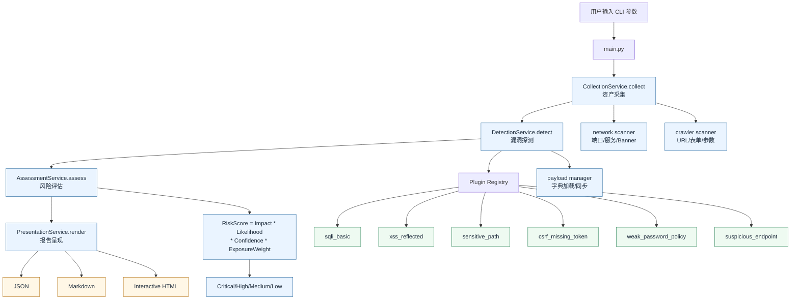

# VMP-Scanner

<p align="center">
  <strong>Visible, Measurable, and Perceivable Network Scanning and Vulnerability Detection System</strong><br />
  可见、可测、可感的分层网络扫描与漏洞检测系统
</p>

<p align="center">
  <a href="https://www.python.org/downloads/">
    =3.12" src="https://img.shields.io/badge/Python-3.12%2B-3776AB?logo=python&logoColor=white">
  </a>
  <a href="https://github.com/astral-sh/uv">
    
  </a>
  
</p>

本项目以 DVWA 作为标准化训练环境，提供从资产采集、漏洞探测、风险评估到报告呈现的端到端流程。

## 目录

- [项目能力](#项目能力)
- [架构与技术](#架构与技术)
- [项目结构](#项目结构)
- [环境准备](#环境准备)
- [快速开始](#快速开始)
- [参数总览](#参数总览)
- [报告说明](#报告说明)
- [测试与质量保障](#测试与质量保障)
- [安全与合规](#安全与合规)
- [FAQ](#faq)
- [相关文档](#相关文档)
- [版本信息](#版本信息)

## 项目能力

### 核心能力

1. 资产采集（Collection）
   - 网络侧：TCP 端口扫描、服务猜测、可选 Banner 抓取。
   - Web 侧：URL 与表单采集、参数面发现、可疑端点汇总。
2. 漏洞探测（Detection）
   - 插件化执行框架，支持 `test` 与 `attack` 模式。
   - 内置 SQLi、XSS、敏感路径、CSRF、弱口令策略、可疑端点插件。
3. 风险评估（Assessment）
   - 评分模型：`RiskScore = Impact * Likelihood * Confidence * ExposureWeight`。
   - 输出风险分级：Critical / High / Medium / Low。
4. 报告呈现（Presentation）
   - 支持 JSON、Markdown、交互式 HTML 报告。
   - 支持风险分布、检索筛选、明细查看与导出。

### 典型场景

1. 教学靶场（DVWA）漏洞验证与演示。
2. 内网测试环境的安全自查与风险归档。
3. 插件开发与漏洞检测策略实验。

## 架构与技术

### 分层架构

1. Collection Layer：资产采集层。
2. Detection Layer：漏洞探测层。
3. Assessment Layer：风险评估层。
4. Presentation Layer：报告表现层。

### 框架流程图



主调用链：

1. `CollectionService.collect`
2. `DetectionService.detect`
3. `AssessmentService.assess`
4. `PresentationService.render`

### 技术栈

- Python 3.12+
- 依赖与环境：`uv`
- 网络与 HTTP：`socket`、`requests`
- 解析：`beautifulsoup4`
- 测试：`pytest`

### 插件与字典机制

1. 插件生命周期：`metadata -> match -> probe -> verify -> evidence`。
2. Payload 字典分类型维护：`sqli`、`xss`、`csrf`、`path_traversal`。
3. 支持从 PayloadsAllTheThings 同步，并支持增量合并。

## 项目结构

```text
VMP-Scanner/
├── main.py                         # CLI 入口，编排四层调用
├── pyproject.toml                  # 项目配置与依赖声明
├── scanner/
│   ├── collection/                 # 采集层
│   ├── detection/                  # 探测层
│   ├── assessment/                 # 评估层
│   └── presentation/               # 表现层
├── tests/                          # 单元与集成测试
├── tools/                          # 快速运行与字典同步脚本
├── doc/                            # 设计与接口文档
└── reports/                        # 报告输出目录
```

## 环境准备

### 前置要求

1. macOS / Linux / Windows（推荐支持 Python 3.12 的环境）。
2. 已安装 Python 3.12+。
3. 已安装 uv（推荐）。

安装 uv（任选其一）：

```bash
# macOS (Homebrew)
brew install uv

# 通用方式
curl -LsSf https://astral.sh/uv/install.sh | sh
```

### 安装依赖

```bash
uv sync
```

建议统一使用 `uv run ...` 执行命令，避免环境不一致。

### 基础自检

```bash
uv run python main.py --help
```

### DVWA 运行建议

1. 目标地址可访问（如 `http://127.0.0.1/dvwa/`）。
2. 已知可用账号密码（示例：`admin` / `password`）。
3. 需要登录态页面可通过 `--auto-login` 建立会话。

## 快速开始

### 方式 A：快捷脚本（macOS / Linux）

```bash
chmod +x tools/run_on_dvwa.sh
./tools/run_on_dvwa.sh
```

### 方式 B：手动运行完整命令

```bash
uv run python main.py \
  --target "http://127.0.0.1/dvwa/" \
  --mode attack \
  --max-depth 2 \
  --allowed-domain 127.0.0.1 \
  --auto-login \
  --auth-login-url /dvwa/login.php \
  --auth-username admin \
  --auth-password password \
  --auth-submit-field Login \
  --auth-submit-value Login \
  --auth-success-keyword logout.php \
  --auth-extra security=low \
  --report-json reports/risk-report.json \
  --report-markdown reports/risk-report.md \
  --report-html reports/risk-report.html \
  --log-level INFO
```

执行后可在 `reports/` 目录下查看：

1. `risk-report.json`
2. `risk-report.md`
3. `risk-report.html`

### 常用场景命令

```bash
# 仅采集层输出（用于调试爬虫）
uv run python main.py \
  --target "http://127.0.0.1/dvwa/" \
  --max-depth 2 \
  --allowed-domain 127.0.0.1 \
  --crawler-output-json reports/crawl-report.json

# 指定插件执行
uv run python main.py \
  --target "http://127.0.0.1/dvwa/" \
  --mode test \
  --enable-plugin sqli_basic \
  --enable-plugin xss_reflected \
  --disable-plugin weak_password_policy

# 主流程扫描前同步 payload 字典
uv run python main.py \
  --target "http://127.0.0.1/dvwa/" \
  --sync-payloads \
  --payload-sync-ref master

# 工具脚本同步（可增量）
uv run python tools/sync_payloads.py \
  --payload-dir scanner/detection/payloads \
  --repo-ref master \
  --incremental
```

## 参数总览

以下参数来自当前 `main.py` CLI。

### 通用参数

| 参数 | 类型 | 默认值 | 说明 |
| --- | --- | --- | --- |
| `--target` | string | `127.0.0.1` | 目标主机或 URL |
| `--mode` | enum | `detect` | 运行模式：`detect/test/attack`（`detect` 内部按 `test` 执行） |
| `--log-level` | enum | `INFO` | 日志级别：`DEBUG/INFO/WARNING/ERROR/CRITICAL` |

### 采集层参数（网络 + 爬虫）

| 参数 | 类型 | 默认值 | 说明 |
| --- | --- | --- | --- |
| `--max-depth` | int | `2` | 爬虫最大深度 |
| `--concurrency` | int | `20` | 并发数 |
| `--timeout` | float | `1.0` | 网络超时（秒） |
| `--ports` | string | `80,443,8080,3306` | 逗号分隔端口列表 |
| `--port-range` | string | `None` | 端口范围，例如 `1-1024`（设置后覆盖 `--ports`） |
| `--allowed-domain` | repeatable | 目标域名 | 白名单域名，可重复传入 |
| `--grab-banner` | flag | `False` | 尝试抓取轻量服务 Banner |
| `--crawler-output-json` | path | `None` | 输出爬虫结果 JSON |

### 登录态与认证参数

| 参数 | 类型 | 默认值 | 说明 |
| --- | --- | --- | --- |
| `--cookie` | string | `None` | 手动 Cookie 头 |
| `--auto-login` | flag | `False` | 启用通用表单自动登录 |
| `--auth-login-url` | string | `None` | 登录 URL（相对或绝对） |
| `--auth-username` | string | `admin` | 登录用户名 |
| `--auth-password` | string | `password` | 登录密码 |
| `--auth-username-field` | string | `username` | 用户名字段名 |
| `--auth-password-field` | string | `password` | 密码字段名 |
| `--auth-csrf-field` | string | `user_token` | CSRF 字段名 |
| `--auth-submit-field` | string | `None` | 提交按钮字段名 |
| `--auth-submit-value` | string | `None` | 提交按钮字段值 |
| `--auth-success-keyword` | string | `None` | 登录成功判定关键字 |
| `--auth-extra` | repeatable | `None` | 额外表单字段，格式 `key=value` |

### 探测插件参数

| 参数 | 类型 | 默认值 | 说明 |
| --- | --- | --- | --- |
| `--enable-plugin` | repeatable | `None` | 仅启用指定插件 |
| `--disable-plugin` | repeatable | `None` | 禁用指定插件 |
| `--detection-plugin-timeout` | float | `None` | 全局插件超时 |
| `--detection-plugin-max-targets` | int | `None` | 全局插件目标上限 |
| `--plugin-timeout` | repeatable | `None` | 插件级超时，格式 `plugin=seconds` |
| `--plugin-max-targets` | repeatable | `None` | 插件级目标上限，格式 `plugin=count` |

内置插件名称：

1. `suspicious_endpoint`
2. `sqli_basic`
3. `xss_reflected`
4. `sensitive_path`
5. `csrf_missing_token`
6. `weak_password_policy`

### Payload 同步参数

| 参数 | 类型 | 默认值 | 说明 |
| --- | --- | --- | --- |
| `--sync-payloads` | flag | `False` | 扫描前同步开源 payload 字典 |
| `--payload-sync-ref` | string | `master` | 同步使用的分支/标签/提交 |
| `--payload-sync-max-per-category` | int | `200` | 每类最大导入数量 |
| `--payload-sync-timeout` | float | `20.0` | 同步请求超时 |
| `--payload-sync-incremental` | flag | `False` | 增量合并模式 |

### 报告输出参数

| 参数 | 类型 | 默认值 | 说明 |
| --- | --- | --- | --- |
| `--report-json` | path | `None` | 输出完整风险 JSON 报告 |
| `--report-markdown` | path | `None` | 输出 Markdown 报告 |
| `--report-html` | path | `None` | 输出交互式 HTML 报告 |

<details>
<summary>点击查看参数使用建议</summary>

- 教学演示推荐：`--mode test --max-depth 2 --allowed-domain 127.0.0.1`
- 靶场验证推荐：`--mode attack --auto-login --auth-success-keyword logout.php`
- 调试爬虫推荐：增加 `--crawler-output-json` 便于分析抓取质量

</details>

## 报告说明

风险报告主要包含以下部分：

1. `assets`：网络资产统计、Web 资产统计、详细资产列表。
2. `vulnerabilities`：漏洞总数、按类别统计、按严重级别统计、漏洞明细。
3. `risks`：风险项列表与分级统计。
4. `recommendations`：按漏洞类别聚合的修复与复测建议。
5. `errors`：collection / detection / assessment 分层错误信息。

## 测试与质量保障

```bash
# 运行全部测试
uv run --with pytest pytest -q

# 运行指定测试
uv run --with pytest pytest -q tests/test_detection_service.py
```

## 安全与合规

1. 本工具仅用于合法授权场景（教学、实验室、内网自查）。
2. 禁止在未授权目标上执行扫描或攻击行为。
3. `attack` 模式可能产生较高风险请求，使用前请确认隔离环境与授权范围。

## FAQ

### Q1：为什么 `--mode detect` 最终按 `test` 执行？

为了兼容历史命令，CLI 接受 `detect`，内部统一映射到探测层 `test` 模式。

### Q2：登录后仍被重定向到登录页怎么办？

建议依次检查：

1. `--auth-login-url` 是否正确。
2. `--auth-submit-field/--auth-submit-value` 是否与表单一致。
3. 是否需要 `--auth-extra security=low` 这类额外字段。
4. `--auth-success-keyword` 是否可用于判定成功登录。

### Q3：如何只输出报告，不关心控制台详情？

```bash
uv run python main.py --target http://127.0.0.1/dvwa/ --report-html reports/risk-report.html
```

## 相关文档

1. `doc/PROJECT_PLAN.md`：项目目标、里程碑、整体设计。
2. `doc/LAYER_SERVICE_INTERFACE_SPEC.md`：层间契约与字段映射。
3. `doc/TODO.md`：阶段任务与完成情况。
4. `scanner/*/README.md`：各层详细实现说明。

## 版本信息

- 工具版本：`0.1.0`
- Python 要求：`>=3.12`

